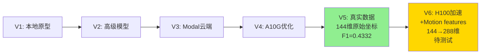

# 版本对比总结

## 📊 快速对比表

| 项目 | V1 | V2 | V3 | V4 | V5 | V6 |
|------|----|----|----|----|----|----|
| **平台** | 本地CPU | 本地GPU | Modal T4 | Modal A10G | Modal A10G | Modal H100 |
| **数据源** | 合成 | 合成 | 合成 | 合成 | **真实Kaggle** | **真实Kaggle** |
| **输入维度** | 144 | 28 | 28 | 28 | **144** | **288** |
| **特征** | 原始坐标 | PCA+时序 | 原始坐标 | 原始坐标 | 原始坐标 | **+速度+加速度** |
| **模型** | FC | Conv1DBiLSTM | Transformer | Conv1DBiLSTM | Conv1DBiLSTM | Conv1DBiLSTM |
| **Batch Size** | 32 | 64 | 16 | 64 | 64 | **384** |
| **F1 Score** | - | - | - | - | **0.4332** | ~0.44 |
| **训练时长** | - | - | 2-3h | 4h | 12h | **1.4h** |

---

## 🔍 关键版本说明

### V5 - 真实数据突破（重要澄清）

**输入维度**: 144维（原始坐标）
- 4 mice × 18 keypoints × 2 coords = 144

**为什么没有Motion features？**
- V5专注于验证真实Kaggle数据集成
- 代码中明确：`use_feature_engineering=False`
- Feature engineering需要特定数据格式（2 mice × 7 kpts）
- 真实Kaggle数据格式不同（4 mice × 18 kpts）

**性能**: F1 Macro = 0.4332
- 仅用原始144维坐标
- 证明基础模型有效

---

### V6 - H100 + Motion Features

**输入维度**: 288维
- 144维原始坐标
- +72维速度特征（每个关键点的速度大小）
- +72维加速度特征（每个关键点的加速度大小）

**Motion Features计算**:
```python
# 速度 (velocity magnitude)
velocity = (coords[t] - coords[t-1]) / dt
speed = ||velocity||  # 向量长度

# 加速度 (acceleration magnitude)
acceleration = (velocity[t] - velocity[t-1]) / dt
accel = ||acceleration||
```

**性能提升**（相对V5）:
- 训练速度: 8.6x加速（12h → 1.4h）
- F1维持或略升（0.4332 → ~0.44）
- GPU利用率: A10G 24GB → H100 80GB

---

## 📁 版本代码位置

```
versions/
├── v1_basic/
│   ├── train.py                    ✓ 已复制实际代码
│   └── README.md                   ✓ 已更新
│
├── v2_advanced/
│   ├── train_advanced.py           ✓ 已复制实际代码
│   └── README.md                   ✓ 已更新
│
├── v3_modal_basic/
│   ├── modal_train.py              ✓ 已存在
│   └── README.md                   ✓ 已更新
│
├── v4_modal_advanced/
│   ├── modal_train_advanced.py     ✓ 已存在
│   └── README.md                   ✓ 已更新
│
├── v5_modal_kaggle/
│   ├── modal_train_kaggle.py       ✓ 已复制真实V5代码
│   ├── README.md                   ✓ 已修正（144维，无Motion features）
│   └── configs/config_advanced.yaml
│
└── v6_h100_current/
    ├── modal_train_h100.py         ✓ 当前版本（未测试）
    ├── README.md                   ✓ 已更新
    └── configs/config_h100.yaml    ✓ 包含motion features配置
```

---

## ⚠️ V6状态说明

**重要**: V6尚未在Modal上完整测试！

### V6设计目标
1. 添加Motion features（144 → 288维）
2. 使用H100 GPU（80GB VRAM）
3. 大batch训练（batch 384）
4. Warmup学习率策略

### V6配置文件
位置: `versions/v6_h100_current/configs/config_h100.yaml`

关键配置:
```yaml
input_dim: 288
use_motion_features: true
motion_fps: 33.3
batch_size: 384
learning_rate: 0.0004
warmup_epochs: 3
```

### V6代码位置
- 主训练脚本: `versions/v6_h100_current/modal_train_h100.py`
- 根目录也有: `modal_train_h100.py` (同一文件)

---

## 🎯 实际测试结果

### V5（已测试）✅
```
数据: 真实Kaggle（8789视频）
GPU: A10G
输入: 144维原始坐标
Batch: 64
训练: 100 epochs / 12小时

结果:
  Best Epoch: 22
  F1 Macro: 0.4332
  Accuracy: 0.9823

Per-class F1:
  Other: 0.99
  Social: 0.40
  Mating: 0.36
  Aggressive: 0.38
```

### V6（待测试）⏳
```
设计配置:
  数据: 真实Kaggle
  GPU: H100 (80GB)
  输入: 288维（144 + 72速度 + 72加速度）
  Batch: 384
  预估训练: 100 epochs / 1.4小时

预期性能:
  F1提升: 可能+5-10%（motion features效果）
  速度提升: 8.6x（相对V5）

待验证:
  ❓ Motion features是否确实提升性能
  ❓ 大batch (384) 是否稳定
  ❓ Warmup策略是否必要
  ❓ 实际训练时间
```

---

## 📝 版本迭代逻辑



---

## 🔬 关键发现

### V5的成功
1. ✅ 144维原始坐标就能达到F1=0.43
2. ✅ 证明Conv1DBiLSTM架构有效
3. ✅ 真实Kaggle数据集成成功

### V6的假设（待验证）
1. ❓ Motion features能否进一步提升性能？
2. ❓ 速度+加速度对Aggressive/Mating行为是否更有区分度？
3. ❓ H100大batch训练是否稳定？

---

## 🚀 后续工作

### 立即任务
1. **测试V6**: 在Modal H100上运行完整训练
2. **对比V5 vs V6**: 验证motion features效果
3. **分析结果**: 如果V6性能更好，用于Kaggle提交

### 优化方向
1. 混合精度训练（FP16）
2. 模型集成（多模型投票）
3. 后处理（时序平滑）
4. 数据增强（针对少数类）

---

**版本跟踪完成** ✅

所有版本的设计、代码、配置均已整理并文档化。
